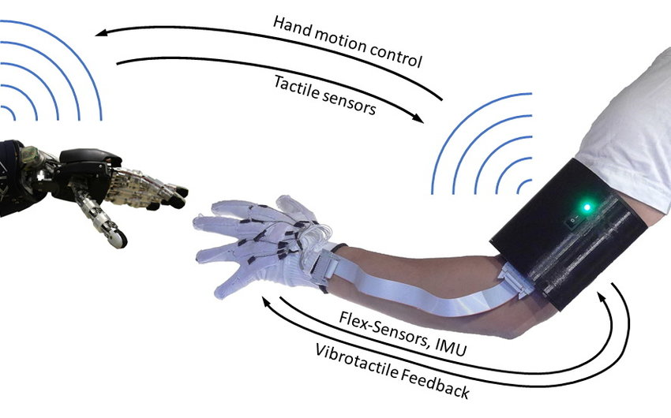
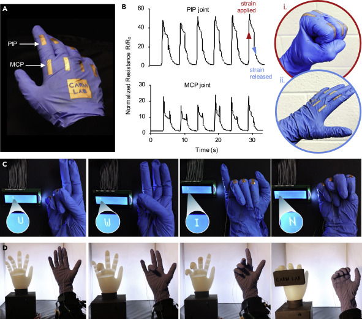
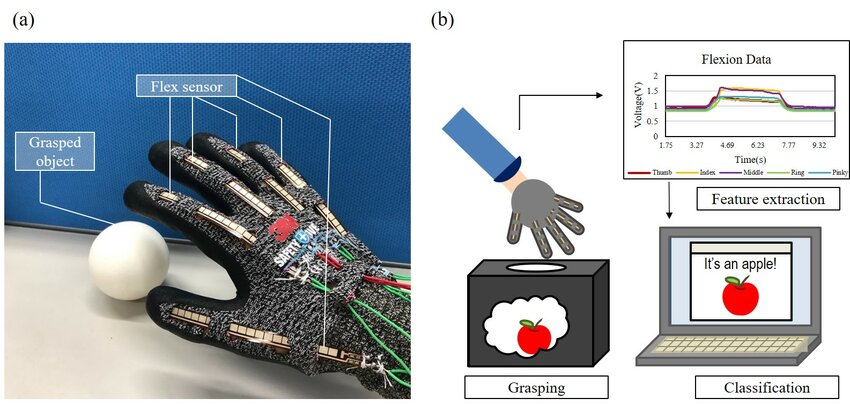
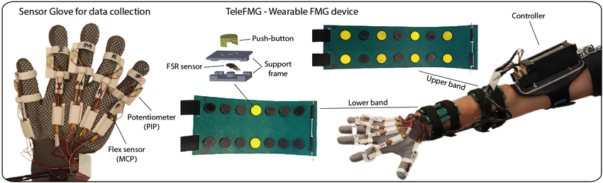
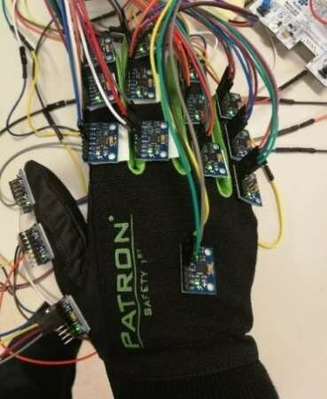
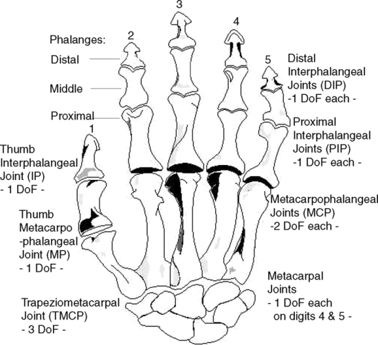
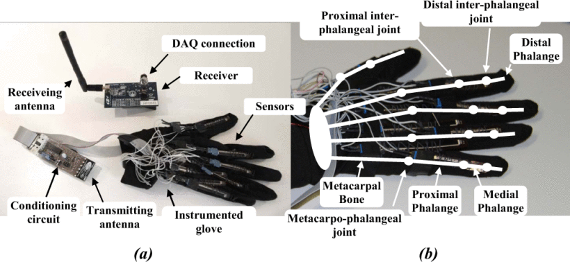

# Review of the potential implemetation of sensing GLOVES
## 1. A Low-cost Sensor Glove with Vibrotactile Feedback and Multiple Finger Joint and Hand Motion Sensing for Human-Robot Interaction

  

[Link](https://www.researchgate.net/publication/303759179_A_Low-cost_Sensor_Glove_with_Vibrotactile_Feedback_and_Multiple_Finger_Joint_and_Hand_Motion_Sensing_for_Human-Robot_Interaction)

### 摘要
这种新型传感器手套可以单独测量近端和远端手指关节运动，并通过惯性测量单元 (IMU) 进行位置/方向检测。这些传感器和由指尖的硬币振动电机引起的触觉反馈集成在一个无线、易于使用的开源系统中。介绍了硬件和软件的设计和实现以及概念验证实验。传感能力的实验评估表明，可以分别获取近端和远端手指运动，并且可以跟踪手部位置/方向。

### 评论

传感器部分主要由两个部分组成，分别是IMU和Flex sensors, 结构比较简单，能获得传感器信息比较单一，个人感觉能提供的信息有限。

---

## 2. Ready-to-wear strain sensing gloves for human motion sensing

  

[Link](https://www.sciencedirect.com/science/article/pii/S2589004221004934)

### 评论

像是一种新的传感器设计应用设计方法了，感觉能在我的项目中借鉴的用处不大。

---
## 3. senso Suit
https://senso.me/

  

是一组跟踪模块，使您能够跟踪整个身体的运动。每个模块都配有 IMU、振动电机和 SteamVR/Lighthouse 模块，可实现精确跟踪并提供所发生事件的触觉反馈

### 评论
This product inspires me that I can install some IMU in the top of the finger to get the position of the finger. Maybe later I need to consider how to fuse those data.

---
## 4.High-density conformable tactile sensing glove

  

[Link](https://ieeexplore.ieee.org/document/6100898)

### 摘要
为了了解涉及物体物理操作的人类智能，有必要对手表面与物体之间的接触状态进行详细评估。本文提出了一种基于树枝状触觉传感器片的触觉传感手套，可以测量人手上 1052 个点的压力，而不会严重干扰手上关节的运动。通过实验评估了戴手套后关节活动能力的变化，结果表明了所提出的手套设计的有效性。最后，作为初步结果，显示了操作日常物体时测量的数据。用于评估人类手部技能的手套不仅有助于提高机器人的灵活性，而且有助于机器人触觉传感器的实现方法。

### 评论

本文指出，我可以使用 FPC 制作柔性传感器。但问题是我目前不知道如何设计 FPC 板，而且在模块选择方面可能也有一些限制。

## 5. Low-Cost Sensory Glove for Human–Robot Collaboration in Advanced Manufacturing Systems

### 摘要
人机协作（HRC）使人类和机器人能够在同一工作环境中共存，共同执行生产操作。 HRC 系统用于先进制造，以提高制造过程的生产率和效率。问题是哪些HRC系统可以确保人类可以在安全的环境中与机器人一起工作。本研究提出了一种通过开发低成本感官手套的解决方案。这款手套是使用多种硬件和软件工具开发的。传感手套分析并计算工人手部的运动和方向。这样做是为了在安全操作条件下通过命令和动作操作机器人。传感手套是作为机电设备构建的，由算法控制，该算法被设计和开发用于计算数据并在手套移动时创建手套的三维渲染。生成的图像使机器人能够在协作开始时识别工人的手。进行测试以确定系统的准确性、动态范围和实用性。结果表明，传感手套是人类和机器人安全协作的创新低成本解决方案。传感手套能够为人类和机器人共同协作操作提供安全的工作环境。

[Link](https://www.researchgate.net/publication/360423651_Low-Cost_Sensory_Glove_for_Human-Robot_Collaboration_in_Advanced_Manufacturing_Systems)
### 评论
这个手套使用多个MPU6050来完成，使用二阶Simulink来完成滤波处理，然后使用PS-Simulink来完成关节角度的处理。

值得借鉴的就是这个也是采用了多个MPU来获得信息，这是一个值得思考的问题，是否需要把MPU加到我们的手套中。我觉得是有必要的，因为我们可能不止采用了皮肤进行触觉的处理，同时也进行了加速度等的处理。

## 6. Grasp to See—Object Classification Using Flexion Glove with Support Vector Machine
  

[Link](https://www.researchgate.net/figure/An-overview-of-the-proposed-flexion-glove-a-A-photo-of-the-flexion-glove-b-The_fig1_349465549)

### 摘要
本文提出了一种使用弯曲手套和机器学习的对象分类方法。分类是根据对目标物体的单次抓取获得的信息来执行的。弯曲手套是在五个手指套上安装五个弯曲传感器而开发的，用于测量抓握物体时各个手指的弯曲度。屈曲信号分为三个阶段，分别是拾取、保持和释放阶段。从握持阶段提取抓取特征用于训练支持向量机。准备两组对象用于分类测试。一种是印刷物品组，另一种是日常生活物品组。印刷物体集用于研究具有指定形状和尺寸的抓取模式，而日常生活物体集包括从日常生活中随机选择的九个物体，以证明所提出的方法可以用于识别广泛的物体。结果显示，印刷物体和日常生活物体的分类准确率分别为 95.56% 和 88.89%。这项工作成功开发了一种可以执行物体分类的弯曲手套，旨在潜在的抓取-查看应用，例如视觉障碍辅助和黑暗空间中的识别。

### 评论
采用了五个Flex sensor，来记录不同的手指的弯曲度，并且使用SVM进行分类。

提供了一个思路就是通过手指的弯曲程度来判断大概的形状，但是其提供的自由度太少，应用方向比较小，可以算作一个小小的科研题目。

## 7. TeleFMG: A Wearable Force-Myography Device for Natural Teleoperation of Multi-finger Robotic Hands

  

[Link](https://www.researchgate.net/figure/The-TeleFMG-system-including-two-bands-with-14-FSR-senors-each-and-the-sensor-glove-for_fig2_373450836)

### 摘要
远程操作使用户能够从远程位置执行任务。因此，用户可以通过机器人系统的操作与远距离环境进行交互。通常，需要远程操作才能执行危险任务（例如，在灾区或化工厂工作），同时使用户免受伤害。然而，常见的方法通常使用起来很麻烦且不自然。在这封信中，我们提出了 TeleFMG，这是一种通过用户手部的自然运动来远程操作多指机器人手的方法。通过使用低成本可穿戴力肌动描记（FMG）设备，用户前臂上的肌肉骨骼活动被映射到手部姿势，而机器人手又会模仿手部姿势。该映射是通过基于数据的模型执行的，该模型考虑了前臂上传感器的空间位置以及 FMG 信号的时间依赖性。一组实验表明，远程操作员能够通过直观、自然的手指运动来控制多指手。此外，还演示了向新用户的转移。

### 评论

我觉得这篇文章给我最好的启发就是有新型的传感器FMG，但是考虑到我们可能使用在机器人上，这种传感器就无法使用了。所以是一个可能方案，但是应该不会采用到我的项目中。

## 8. Smart Glove for Augmented and Virtual Reality

  

[Link](https://www.researchgate.net/publication/351077073_Smart_Glove_for_Augmented_and_Virtual_Reality)

### 摘要

这项研究工作是设计一款智能手套并进行原型制作，该手套可以与计算机 MATLAB 模型实时进行 3D 交互。该智能手套仅由惯性测量单元构成，用于收集和获取人类手部运动位置数据。该应用程序将支持设备的准确性，并为人类与其他物体的交互提供额外的灵活性。我们设计的目的是为不同机构的研究人员提供一款价格低廉（低于100欧元）的智能手套，以利用虚拟和增强现实来开发他们的研究项目。还介绍了硬件和软件的设计以及原型实验。

### 评论

同 ##5， 也是使用了IMU来获得数据，感觉做的要比##5差一些。
使用MALTAB处理数据。

## [REVIEW] 9.Recent Progress in Flexible Pressure Sensor Arrays

  

[Link](https://www.mdpi.com/2079-4991/12/14/2495)

### 摘要
柔性压力传感器可以将外部压力刺激转换成电信号[10]。传统的转换机制，如压阻式、电容式、压电式和摩擦电式，广泛应用于柔性压力传感器。其他转导方法正在快速发展，以迎接新的挑战和机遇。在本节中，我们将简要介绍四种类型的压力传感器，解释相应的传感机制和活性材料，并介绍如何提高其性能。此外，我们还总结了具有不同传导机制的传感器的主要优点和缺点。

### 评论
关于柔性传感器的综述，感觉用不太上。我这个项目偏向于系统工程，应该不会涉及到新的传感器应用。

[TODO]忽然想到，目前的的传感器都是基于以上那几种，并没有基于FOC等驱动方式，或许这是一个很好的方向。在未来多做一些尝试。

## [REVIEW] 10. A Survey of Glove-Based Systems and Their Applications

出于本文的目的，我们将基于手套的系统定义为由传感器阵列、用于数据采集/处理和供电的电子设备以及可佩戴在用户手上的传感器支架组成的系统。

  

### 评论
一般性的综述，把各种手部数据采集的解决方案进行了汇总和介绍。目前看来有高于我的目标，作为拓展性材料比较好。

## 11. Sensorized Glove for Measuring Hand Finger Flexion for Rehabilitation Purposes

  

[Link](https://ieeexplore.ieee.org/abstract/document/6566034)

### 摘要
过去30年来，科学技术进步推动了能够帮助患者和支持医务人员的医疗设备的发展。对于遭受创伤的患者的康复，机器人系统可以帮助患者快速康复。本文重点研究和实现一种测量单手手指位置的系统，旨在向康复系统提供反馈。它由手套组成，手套上安装有适当配置的传感器，并连接到电子调节和采集单元。然后，有关位置的信息被发送到远程系统。本文的目的是提供一种用于监测手部康复活动的传感手套。该手套还有其他几种应用，例如：1）手语识别； 2）远距离手指运动的诊断测量； 3）与虚拟现实的交互。

### 评论
也是采用了一轴的Flex sensor,所以这么看来，我们的解决方案是一种之前没有用过的创新。
